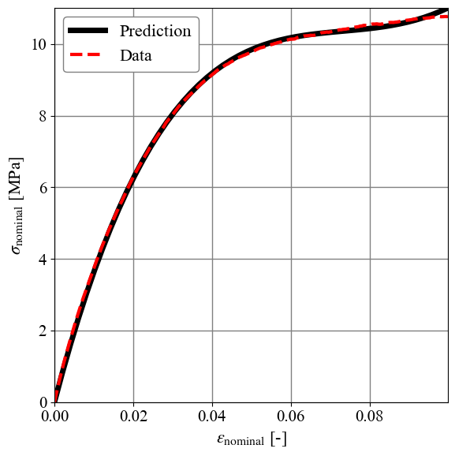

# hippoelasto
**hippoelasto** is a Python package for hyperelastic material characterization and calibration, and VUMAT generation for finite element modeling in Abaqus.

## Purpose  
**hippoelasto** is built for researchers and engineers working with soft material modeling and simulation. It provides a full pipeline from experimental data fitting to VUMAT generation for hyperelastic material models.

1. Load and manage experimental stress-strain data 
1. Select and configure hyperelastic material models 
3. Calibrate model parameters using optimization routines
4. Visualize fitted results and assess model performance
5. Automatically generate a VUMAT subroutine for Abaqus

# Installation
Install **hippoelasto** by cloning the repository onto your local machine using the following command

    git clone https://github.com/MrJSimon/hippoelasto.git

### Requirements
This program was tested using

    python 3.10.9

Install the required Python packages, listed in requirements.txt, with:  

    pip install -r requirements.txt

# Getting started
This package is intended to be run through a Python IDE (PyCharm, VSCode, Spyder, etc.). 

    python hippoelasto/main.py

# Basic workflow

### 📂 Step 1: Load data
The data file must be comma-separated and contain the following columns:

| strain [-] | stress [MPa] |
|---------------:|--------------:|
| 0.0          | 0.069           |
| 0.011          | 4.109         |
| 0.022          | 6.654         |
| ⋮              | ⋮              |
| 0.066          | 10.246        |
| 0.077          | 10.483        |
| 0.088          | 10.643        |
| ⋮              | ⋮              |

Place your tensile data file (e.g., yourfile.txt) in the data/ folder of the repository.

```python
# Load in data
data = np.loadtxt('data\\nominal_stress_strain_data.txt',delimiter=',')

# Set strain- and stress data
eps_n, sig_n = data[:,0], data[:,1]
```

### ⚙️ Step 2: Choose Material Model
**Specify a custom hyperelastic model** (e.g., Neo-Hookean, Mooney-Rivlin, Ogden) in terms of strain energy potential

```python
# Define symbolic variables
C10, C01, C20 = sp.symbols('C10 C01 C20')

# Define placeholders for modified invariants
I1b, I2b, J_sym = sp.symbols('I1b I2b J')

# Define stretches uniaxial state
lambda_11, lambda_22, lambda_33 = sp.symbols('lambda_11 lambda_22 lambda_33', positive=True)

# Define strain energy function
W = C10 * (I1b - 3) + C01 * (I2b - 3) + C20 * (I1b - 3)**2

# Create combined list for symbolic derivation
symbolic_combi_list = (lambda_11,lambda_22,lambda_33,
                       C10, C01, C20)

# Create symbolic list for the VUMAT.f file
symbolic_param_list = [C10,C01,C20]
symbolic_deriv_list = [sp.diff(W, I1b), sp.diff(W, I2b)]
symbolic_namin_list = ['dWdI1','dWdI2']
```
Note: support for selecting built-in models (e.g., Neo-Hookean, Mooney-Rivlin, Ogden) is planned.

### 🔧 **Steps 3–7: Optimization, VUMAT generation, and plotting**

To see the full calibration pipeline and how to generate a VUMAT from your model:

➡️ [See full workflow in `docs/quickstart.md`](docs/quickstart.md)

# Visualizations

**Prediction vs. Data**: Visualization of prediction vs. data in terms of nominal stress and strain,
<p align="center">
  
</p>

# Output Files

| File Name                                       | Description                                |
|-------------------------------------------------|--------------------------------------------|
| VUMAT_2D_planestrain_incompressible_modified.f  | User Material subroutine                   |
| PredictionVsData.png                            | Fitted prediction                          |

# Documentation
For more details, visit the [Wiki](https://github.com/MrJSimon/hippoelasto/wiki).
